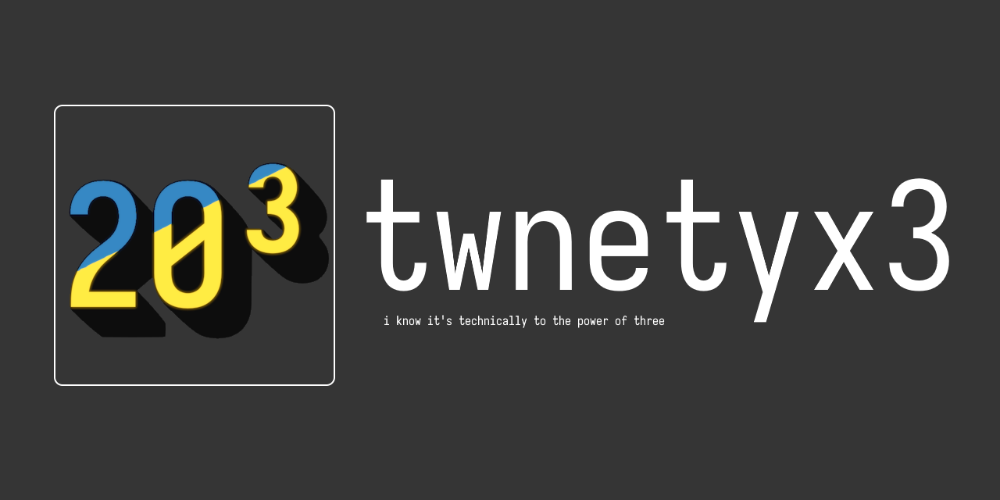
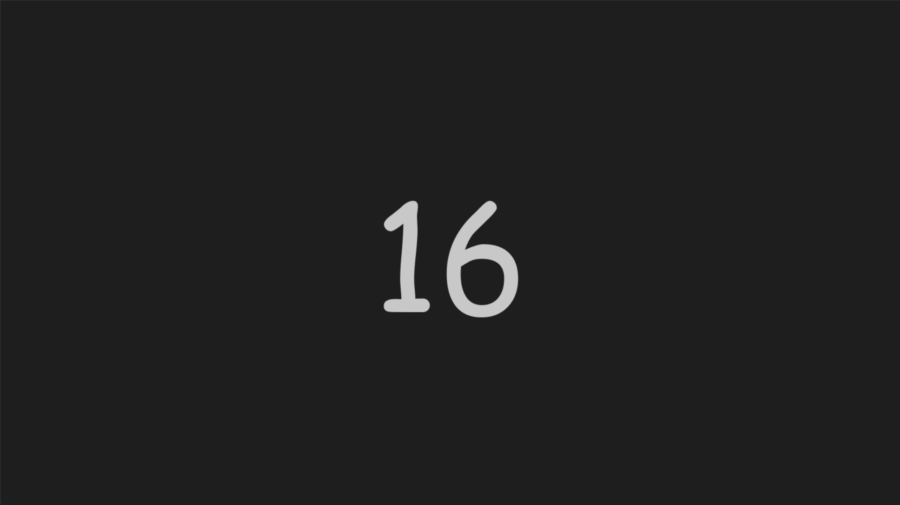

    

A *forced* eye rester for windows. Original by ZXTube  
An app that forces you every 20 minutes to look at something 20 feet away for 20 seconds

## Table of contents
- [Installation](#-installation)
- [Preview](#-preview)
- [Features](#-features)

## Preview:

## Features
- Eye Rest Timer + Overlay
Runs a 20-minute timer and shows a fullscreen countdown overlay as a rest reminder.
- Gamer Mode
Lets you skip breaks by pressing ESC. Toggle from system tray when you need focus.
- System Tray
Toggles gamer mode, and exits the app. Includes simple toast notifications.

## Installation
### Windows
You can download the compiled version at [here](https://github.com/nonepork/twentyx3/releases/tag/Latest)  
Or you could build it yourself using the build.bat
### Other platforms
Since this uses windows api, the likeihood of it getting port to other platforms are, well not much.
